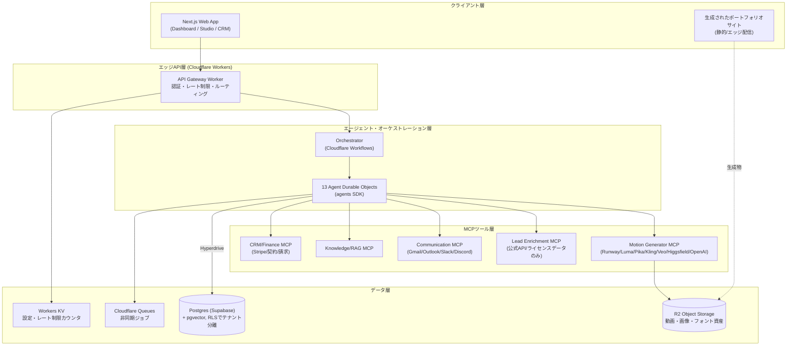

# AI Motion Design Factory — 設計ドキュメント①
## 概要 / 前提 / アーキテクチャ / 技術スタック / ディレクトリ構成

> **📌 更新あり**：本ドキュメントの「Hyperdrive経由でSupabase Postgresに接続」「認証はClerk」という記述は、その後**オープンソース・無料枠のみの構成**に置き換えられました。詳細は [`06-oss-free-stack.md`](./06-oss-free-stack.md) を参照してください。DB接続は自前ホストPostgresへの直接接続、認証は自前ホストのSupabase Auth (GoTrue) です。本ドキュメントのアーキテクチャ図・技術スタック表・ディレクトリ構成はそれ以外の点で引き続き有効です。

---

## 0. 読む前に：スコープと前提について

いただいた2つの資料を統合しています。

1. **`workers-prompt-full_text`**（Cloudflare Workers生成AI用のシステムプロンプト）→ MCP・Durable Objects・Agents SDK・Workflowsまわりの正確な実装規約として採用
2. **AI Motion Design Factory仕様**（本文）→ プロダクト要件として採用

仕様書のBackend欄は「Node.js / PostgreSQL / Supabase / Redis」、Deployは「Vercel / Docker」となっていますが、Storageは「S3互換ストレージ」、検索は「pgvector」と明記されています。これは実は **Cloudflareのスタックとほぼ1対1で対応**します（R2 = S3互換、Supabase Postgres = pgvector込みでそのまま使える）。加えて添付いただいたCloudflare Workers用システムプロンプトがあること、そして過去のプロジェクト（ProjectApp）でWorkers + Durable Objects + D1 + Wranglerを使われていたことから、**バックエンドの実行基盤をCloudflare Workersに寄せ、データ本体はSupabase Postgresに残すハイブリッド構成**を提案します。理由は本ドキュメント §3 で詳述します。

もう一点、率直にお伝えします。ご依頼の最終成果物14項目（アーキテクチャ〜将来拡張計画まで）は**設計・計画ドキュメントとして全項目を作成しました**。一方で「商用SaaSレベルの実装コード一式」を1回のやり取りで生成するのは、実態として数ヶ月・数人月規模の仕事であり誠実ではないため含めていません。かわりに、この設計に基づいてすぐ着手できるMVPスコープとロードマップ（ドキュメント④）、そして主要コンポーネントの雛形コード（DBスキーマ・MCPツール定義・wrangler.jsonc等はドキュメント②③に実コードで記載）を用意しました。次のステップとしてリポジトリの雛形自体を生成することも可能です。

最後に、Lead Finder / AI Sales Agentについては、本文末尾で明示的にご要望のあった「利用規約・法令・プライバシー要件の遵守、明示的確認/承認フロー」を**設計の一級市民**として組み込みました（ドキュメント⑤で詳述）。LinkedIn・Instagram・XなどはToSでスクレイピングを明確に禁止しており、実際に訴訟事例（hiQ Labs v. LinkedIn等）もあるため、これらは公式API/ライセンスされたデータプロバイダ経由に設計しています。理由は§後述の通りです。

---

## 1. システム全体アーキテクチャ

### 1.1 レイヤー構成



### 1.2 なぜこの構成か（設計判断の要点）

| 判断 | 理由 |
|---|---|
| オーケストレーション層をDurable Objects + Workflowsに | 13エージェントは「状態を持つ・並列実行される・長時間実行される・途中で人の承認を待つ」という性質が強く、これはCloudflare WorkflowsとDurable Objectsが最も得意とする領域です。特にWorkflowsは`step.do`単位のリトライ・タイムアウト・スリープ（人の承認待ちなど）をネイティブサポートします |
| 外部AI/データソースをすべてMCPツールとして抽象化 | 「どの動画生成AIでも使える共通インターフェース」という要求そのものがMCPのサーバー/ツール抽象化と一致します。プロバイダ追加時はMCPサーバーを1つ追加するだけで済みます |
| リレーショナルDBはSupabase Postgresを継続採用 | 仕様書に明記されたpgvector・Supabase・RLSによるマルチテナント分離をそのまま活かせます。CloudflareのHyperdriveでWorkersからコネクションプーリング付きで接続します |
| オブジェクトストレージはR2 | 仕様書の「S3互換ストレージ」要件をそのまま満たし、かつ動画・画像配信で egress 課金が発生しない（R2は転送量無料）ため、動画中心のプロダクトでは特にコスト効果が大きいです |
| フロントエンドはNext.js継続、Vercelにデプロイ | 仕様書の明記通り。Vercel Edge / Next.js から Workers API Gatewayを叩く構成にすることで、フロント側の変更は最小限です |

### 1.3 コンポーネント一覧（10サブシステム対応表）

| 仕様書の番号 | サブシステム | 実装場所 |
|---|---|---|
| ① | Motion Generator | `motion-generator-mcp` Worker |
| ② | Prompt Builder | Prompt Engineer Agent + Storyboard Agent（Durable Object） |
| ③ | Portfolio Generator | Video Director Agent → R2 + Workers Static Assetsで公開 |
| ④ | Lead Finder | Lead Finder Agent + `lead-enrichment-mcp`（公式API限定） |
| ⑤ | AI Sales Agent | Sales Agent + `communication-mcp` + 承認ゲート |
| ⑥ | CRM | `crm-mcp` + Postgres `deals`/`contacts`テーブル群 |
| ⑦ | AI Project Manager | Automation Agent（Workflow全体の進行管理） |
| ⑧ | Video Asset Manager | R2 + `knowledge-mcp`のベクトル検索 |
| ⑨ | AI Knowledge | Knowledge Agent + pgvector RAG |
| ⑩ | Analytics | Analytics Agent + Workers Analytics Engine + Postgres集計 |

---

## 2. 技術スタック（確定版）

### Frontend
- **Next.js 15 (App Router) + React + TypeScript**
- **UIライブラリ**：Material UI ではなく、ダークモード基調の「放送コントロールルーム」的マルチパネルUIを目指すため、Tailwind + shadcn/ui を軸に据え、MUIは複雑なデータグリッド（CRM一覧等）にスポット投入する構成を推奨します（詳細はドキュメント④のUI/UX設計）
- デプロイ：Vercel（仕様通り）

### Backend / 実行基盤
- **Cloudflare Workers**（TypeScript, ES Modules, `nodejs_compat`）— APIゲートウェイ、全MCPサーバー
- **Durable Objects**（`agents` SDK）— 13エージェントの実行・状態管理
- **Cloudflare Workflows** — エンドツーエンド自動化パイプラインの耐久実行
- **Cloudflare Queues** — 非同期ジョブ（動画レンダリング監視、一括エンリッチメント、メール送信キュー）
- **Hyperdrive** — WorkersからSupabase Postgresへの接続プーリング

### データ
- **PostgreSQL（Supabase）** — 業務データ本体、Row Level Securityでテナント分離、pgvectorで埋め込み検索
- **R2** — 動画・画像・フォント・ブランド素材（S3互換API、egress無料）
- **Workers KV** — 設定値、レート制限カウンタ、キャッシュ
- **Upstash Redis**（仕様の「Redis」に対応）— セッション/ジョブのpub-sub、Vercel・Workers両方からHTTP経由で利用可能なため採用

### AI
- **Anthropic Claude**（Agentのメイン推論・オーケストレーション）
- **OpenAI / Gemini**（用途別に切替可能な構成、envで切替）
- **Workers AI**（軽量タスク：QAチェックの一次スクリーニング、埋め込み生成のフォールバック）
- **Higgsfield MCP / Runway / Luma / Pika / Kling / Veo** — Motion Generator MCP配下のプロバイダアダプタ

### 認証
- **Clerk**（Organizations機能がテナント/メンバー管理と直接対応するため採用。Supabase Authも選択肢として残しますが、B2Bマルチテナント要件が強いためClerk推奨）

### CI/CD・運用
- GitHub Actions → Wrangler Deploy（Workers）/ Vercel（Frontend）
- Sentry（エラートラッキング）+ Workers Analytics Engine（メトリクス）

---

## 3. ディレクトリ構成（モノレポ）

```
ai-motion-design-factory/
├── apps/
│   ├── web/                          # Next.js フロントエンド（Vercel）
│   │   ├── app/
│   │   │   ├── (dashboard)/
│   │   │   │   ├── studio/           # 商品アップロード→動画生成
│   │   │   │   ├── portfolio/        # ポートフォリオサイト管理
│   │   │   │   ├── leads/            # Lead Finder結果・Kanban
│   │   │   │   ├── campaigns/        # 営業メール/DM管理・受信箱
│   │   │   │   ├── deals/            # CRM パイプライン
│   │   │   │   ├── billing/          # 請求・契約
│   │   │   │   ├── knowledge/        # RAGソース管理
│   │   │   │   ├── analytics/        # ダッシュボード
│   │   │   │   └── control-room/     # 13エージェントのリアルタイム稼働状況
│   │   │   └── api/                  # Next.js BFF（Workers Gatewayへプロキシ）
│   │   └── components/
│   └── portfolio-renderer/           # ポートフォリオサイト生成テンプレート（Workers Static Assets）
├── workers/
│   ├── api-gateway/                  # 認証・ルーティング
│   ├── orchestrator/                 # Workflows定義（パイプライン全体）
│   ├── agents/
│   │   ├── motion-designer/
│   │   ├── prompt-engineer/
│   │   ├── storyboard/
│   │   ├── video-director/
│   │   ├── copywriter/
│   │   ├── lead-finder/
│   │   ├── sales/
│   │   ├── crm/
│   │   ├── finance/
│   │   ├── qa/
│   │   ├── knowledge/
│   │   ├── analytics/
│   │   └── automation/               # 各Durable Objectクラス
│   └── mcp-servers/
│       ├── motion-generator-mcp/
│       ├── lead-enrichment-mcp/
│       ├── communication-mcp/
│       ├── knowledge-mcp/
│       └── crm-finance-mcp/
├── packages/
│   ├── db/                           # Drizzle ORM スキーマ + マイグレーション（Postgres）
│   ├── shared-types/                 # Agent I/O・MCPツールのZod/TypeScript型
│   └── ui/                           # 共有UIコンポーネント（shadcn/ui拡張）
├── infra/
│   ├── wrangler/                     # 各Workerのwrangler.jsonc
│   └── supabase/                     # RLSポリシー、SQL関数
└── .github/workflows/                # CI/CD
```

---

## 4. 各ドキュメントの構成

| ファイル | 内容（仕様書の要求項目との対応） |
|---|---|
| `02-database-api-mcp.md` | データベース設計 / API設計 / MCP設計 |
| `03-agents-workflow.md` | AI Agent設計 / Workflow設計 |
| `04-uiux-roadmap-mvp.md` | UI/UX設計 / 実装ロードマップ / MVP設計 |
| `05-ops-security-compliance-cost.md` | 本番運用設計 / セキュリティ設計 / コンプライアンス / コスト最適化 / 将来の拡張計画 |

続けてご覧ください。
