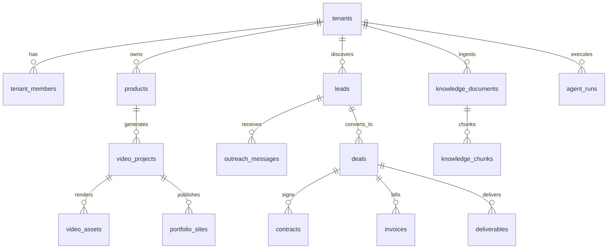

# AI Motion Design Factory — 設計ドキュメント②
## データベース設計 / API設計 / MCP設計

> **📌 更新あり**：[`06-oss-free-stack.md`](./06-oss-free-stack.md) 参照。以下2点が変更されています：(1) `knowledge_chunks.embedding`の次元数は1536(OpenAI)ではなく**768(Workers AI `bge-base-en-v1.5`、既定)**、(2) `tenant_members.user_id`はClerkではなく**Supabase Auth (GoTrue)のuser id**。また、DB接続はHyperdriveではなく`DATABASE_URL`による直接接続です。それ以外のテーブル設計・API設計・MCP設計は有効です。実際のスキーマは`packages/db/src/schema.ts`（`pnpm db:generate`で`packages/db/migrations/`に反映）と、初回セットアップ用の`infra/supabase/bootstrap-schema.sql`を正としてください（`pipeline_runs`・`job_queue`テーブルが追加されています）。

---

## 1. データベース設計

Postgres（Supabase）、`tenant_id`によるRow Level Security（RLS）でマルチテナント分離します。すべてのテナント固有テーブルは`tenant_id uuid not null references tenants(id)`を持ち、RLSポリシーで`auth.jwt() ->> 'tenant_id'`と一致する行のみ参照可能にします。

### 1.1 ER概要（主要エンティティの関係）



### 1.2 コアテーブル DDL（抜粋・主要テーブルのみフル記載）

```sql
-- ============ テナント / 課金 ============
create table tenants (
  id uuid primary key default gen_random_uuid(),
  name text not null,
  slug text unique not null,
  plan text not null default 'trial', -- trial|starter|growth|scale|enterprise
  status text not null default 'active', -- active|suspended|churned
  brand_config jsonb default '{}',      -- ロゴ/カラー/フォント既定値
  created_at timestamptz not null default now()
);

create table tenant_members (
  id uuid primary key default gen_random_uuid(),
  tenant_id uuid not null references tenants(id) on delete cascade,
  user_id uuid not null,               -- Clerk user id
  role text not null default 'member', -- owner|admin|member|viewer
  created_at timestamptz not null default now(),
  unique(tenant_id, user_id)
);

create table tenant_billing_accounts (
  tenant_id uuid primary key references tenants(id) on delete cascade,
  stripe_customer_id text unique,
  stripe_subscription_id text,
  monthly_video_quota int not null default 20,
  monthly_video_used int not null default 0,
  monthly_outreach_quota int not null default 500,
  monthly_outreach_used int not null default 0,
  updated_at timestamptz not null default now()
);

-- ============ プロダクト / 動画生成 ============
-- owner: テナント自身のポートフォリオ用 or 特定リード向けパーソナライズ用
create table products (
  id uuid primary key default gen_random_uuid(),
  tenant_id uuid not null references tenants(id) on delete cascade,
  owner_type text not null,            -- 'tenant_portfolio' | 'lead_pitch'
  lead_id uuid references leads(id),
  source_type text not null,           -- 'url' | 'image'
  source_url text,
  source_image_key text,               -- R2 object key
  analyzed_data jsonb,                 -- LP/画像解析結果（構図・カラー・強み・CTA案）
  created_at timestamptz not null default now()
);

create table video_projects (
  id uuid primary key default gen_random_uuid(),
  tenant_id uuid not null references tenants(id) on delete cascade,
  product_id uuid not null references products(id),
  status text not null default 'queued', -- queued|analyzing|generating|review|approved|failed
  duration_variant text not null,        -- '15s'|'30s'|'60s'
  provider text,                         -- runway|luma|pika|kling|veo|higgsfield|openai
  prompt_spec jsonc,                     -- Prompt Builderの出力（構成/カメラワーク/BGM/字幕/CTA）
  cost_usd numeric(10,4),
  created_at timestamptz not null default now()
);

create table video_assets (
  id uuid primary key default gen_random_uuid(),
  video_project_id uuid not null references video_projects(id) on delete cascade,
  r2_key text not null,
  thumbnail_r2_key text,
  captions_r2_key text,                -- 字幕ファイル
  duration_seconds numeric(6,2),
  qa_status text default 'pending',    -- pending|passed|flagged
  qa_notes jsonb,
  created_at timestamptz not null default now()
);

create table portfolio_sites (
  id uuid primary key default gen_random_uuid(),
  tenant_id uuid not null references tenants(id) on delete cascade,
  slug text unique not null,
  published_url text,
  video_project_ids uuid[] not null default '{}',
  theme jsonb,
  published_at timestamptz
);

-- ============ Lead Finder / Sales ============
create table leads (
  id uuid primary key default gen_random_uuid(),
  tenant_id uuid not null references tenants(id) on delete cascade,
  company_name text not null,
  contact_name text,
  contact_email text,
  socials jsonb,                        -- {linkedin, instagram, x, youtube}
  source text not null,                 -- 'google_maps'|'shopify'|'kickstarter'|'product_hunt'
                                         --  |'crunchbase'|'own_site'|'search_engine'|'csv_import'
  source_provider text,                 -- 実際に使ったデータプロバイダ名（compliance用、§05参照）
  legal_basis text not null default 'legitimate_interest_b2b', -- コンプライアンス根拠の記録
  ad_quality_score numeric(3,2),
  video_quality_score numeric(3,2),
  improvement_notes text,
  deal_probability numeric(3,2),
  consent_status text not null default 'unknown', -- unknown|opted_in|opted_out|do_not_contact
  status text not null default 'new',   -- new|enriched|contacted|replied|qualified|won|lost
  created_at timestamptz not null default now()
);

-- 送信抑制リスト。テナント単位＋グローバル両対応。オプトアウトは即時反映必須
create table suppression_list (
  id uuid primary key default gen_random_uuid(),
  tenant_id uuid references tenants(id) on delete cascade, -- nullならグローバル抑制
  email text not null,
  reason text not null, -- 'unsubscribed'|'bounced'|'complaint'|'manual'
  created_at timestamptz not null default now(),
  unique(tenant_id, email)
);

create table outreach_campaigns (
  id uuid primary key default gen_random_uuid(),
  tenant_id uuid not null references tenants(id) on delete cascade,
  name text not null,
  channel text not null,               -- email|linkedin_dm|slack|discord|line|whatsapp
  requires_human_approval boolean not null default true,
  status text not null default 'draft'
);

create table outreach_messages (
  id uuid primary key default gen_random_uuid(),
  campaign_id uuid not null references outreach_campaigns(id) on delete cascade,
  lead_id uuid not null references leads(id),
  channel text not null,
  generated_body text not null,
  personalized_video_asset_id uuid references video_assets(id),
  status text not null default 'pending_approval', -- pending_approval|approved|sent|replied|bounced|suppressed
  compliance_check jsonb,              -- {suppression_ok, consent_ok, jurisdiction, checked_at}
  sent_at timestamptz
);

-- ============ CRM / 受注 / 請求 ============
create table deals (
  id uuid primary key default gen_random_uuid(),
  tenant_id uuid not null references tenants(id) on delete cascade,
  lead_id uuid references leads(id),
  stage text not null default 'prospect', -- prospect|negotiation|won|lost
  value_usd numeric(12,2),
  currency text default 'USD',
  created_at timestamptz not null default now()
);

create table invoices (
  id uuid primary key default gen_random_uuid(),
  deal_id uuid not null references deals(id),
  stripe_invoice_id text,
  amount_usd numeric(12,2) not null,
  status text not null default 'draft', -- draft|sent|paid|overdue|void
  due_date date
);

create table deliverables (
  id uuid primary key default gen_random_uuid(),
  deal_id uuid not null references deals(id),
  video_asset_id uuid references video_assets(id),
  revision_number int not null default 1,
  client_feedback text,
  status text not null default 'in_progress' -- in_progress|delivered|revision_requested|accepted
);

-- ============ Knowledge / RAG ============
create extension if not exists vector;

create table knowledge_documents (
  id uuid primary key default gen_random_uuid(),
  tenant_id uuid not null references tenants(id) on delete cascade,
  source_type text not null,  -- notion|github|gdrive|pdf|markdown|web|youtube|mediawiki
  source_uri text,
  status text not null default 'pending' -- pending|indexed|failed
);

create table knowledge_chunks (
  id uuid primary key default gen_random_uuid(),
  document_id uuid not null references knowledge_documents(id) on delete cascade,
  content text not null,
  embedding vector(1536),
  metadata jsonb
);
create index on knowledge_chunks using hnsw (embedding vector_cosine_ops);

-- ============ 観測・分析 ============
create table agent_runs (
  id uuid primary key default gen_random_uuid(),
  tenant_id uuid not null references tenants(id) on delete cascade,
  agent_name text not null,
  workflow_instance_id text,
  input_ref jsonb,
  output_ref jsonb,
  status text not null,         -- running|succeeded|failed|awaiting_approval
  tokens_used int,
  cost_usd numeric(10,5),
  duration_ms int,
  created_at timestamptz not null default now()
);

create table analytics_daily_rollups (
  tenant_id uuid not null references tenants(id) on delete cascade,
  day date not null,
  videos_generated int default 0,
  leads_found int default 0,
  messages_sent int default 0,
  reply_rate numeric(5,4),
  win_rate numeric(5,4),
  revenue_usd numeric(12,2),
  primary key (tenant_id, day)
);

-- RLSの例（全テーブルに同様のパターンを適用）
alter table leads enable row level security;
create policy tenant_isolation on leads
  using (tenant_id = (auth.jwt() ->> 'tenant_id')::uuid);
```

> `integration_credentials`（テナントごとのGmail/Slack OAuthトークン等、暗号化列）、`contracts`、`conversations`（返信スレッド・感情/意図分類結果）も同様のパターンで追加しますが、紙面の都合上ここでは割愛します。実装時は`packages/db`でDrizzle ORMのスキーマとして管理し、`drizzle-kit`でマイグレーションを生成する運用を推奨します。

---

## 2. API設計

Next.jsフロントエンドは基本的に**API Gateway Worker**を叩きます（内部的にはMCPツール呼び出しに変換される場合もあります）。認証はClerkのJWTをBearerトークンで付与。

### 2.1 REST エンドポイント一覧（抜粋）

```
POST   /api/v1/products                    # 商品URL/画像アップロード → 解析ジョブ起動
GET    /api/v1/products/:id

POST   /api/v1/video-projects              # 動画生成ジョブ起動（product_id, durations[]）
GET    /api/v1/video-projects/:id
GET    /api/v1/video-projects/:id/status   # ポーリング用

POST   /api/v1/portfolio-sites             # ポートフォリオサイト生成・公開
GET    /api/v1/portfolio-sites/:slug

POST   /api/v1/leads/search                # Lead Finder起動（ソース・条件指定）
GET    /api/v1/leads?status=&source=
PATCH  /api/v1/leads/:id                   # 手動編集・ステータス変更
POST   /api/v1/leads/:id/opt-out           # 抑制リストへ即時追加

POST   /api/v1/campaigns                   # 営業キャンペーン作成
POST   /api/v1/campaigns/:id/generate      # メッセージ一括生成（下書き、未送信）
POST   /api/v1/campaigns/:id/approve       # 人間の承認 → 送信キューへ
GET    /api/v1/campaigns/:id/messages

GET    /api/v1/deals
PATCH  /api/v1/deals/:id/stage

POST   /api/v1/invoices/:id/send
GET    /api/v1/deliverables/:dealId

POST   /api/v1/knowledge/sources           # RAGソース接続（Notion/GitHub/GDrive等）
GET    /api/v1/analytics/summary?range=30d

GET    /api/v1/agents/runs?agent=&status=  # Control Room画面用（エージェント稼働ログ）
WS     /api/v1/agents/stream               # リアルタイム進捗（Durable Object WebSocket）
```

### 2.2 認証・レート制限

- API Gateway Workerで Clerk JWT を検証 → `tenant_id`をコンテキストに注入
- レート制限は Workers KV を使ったスライディングウィンドウ（テナントのプランに応じて上限可変）
- Webhook（Stripe, Gmail push通知等）は署名検証必須、専用エンドポイントに分離

---

## 3. MCP設計

### 3.1 なぜMCPで抽象化するか

「どの動画生成AIでも使える共通インターフェース」（Motion Generator）と「複数のナレッジソースを接続できる」（AI Knowledge）という要件は、そのままMCPのサーバー/ツール設計に対応します。各エージェントは個々のベンダーAPIを直接知らず、MCPツールの入出力契約だけを知っていればよい構成にします。

### 3.2 MCPサーバー一覧

| MCPサーバー | 提供ツール | 備考 |
|---|---|---|
| `motion-generator-mcp` | `generate_video`, `check_generation_status`, `list_providers`, `estimate_cost` | 各プロバイダのアダプタをサーバー内部で切替 |
| `lead-enrichment-mcp` | `search_companies`, `enrich_company`, `check_suppression` | **公式API/ライセンスデータプロバイダのみ**（§05で詳述） |
| `communication-mcp` | `send_email`, `send_slack_message`, `check_delivery_status` | 送信前に必ず`check_suppression`を内部で強制実行 |
| `knowledge-mcp` | `ingest_source`, `search_knowledge`, `list_sources` | pgvectorへのクエリをラップ |
| `crm-finance-mcp` | `update_deal_stage`, `create_invoice`, `record_payment` | Stripe/契約書生成と連携 |

### 3.3 ツール定義例：`generate_video`

```typescript
// motion-generator-mcp/src/tools/generate_video.ts
export const generateVideoTool = {
  name: "generate_video",
  description: "商品情報とプロンプト仕様から動画生成ジョブを開始する（非同期・ジョブID返却）",
  inputSchema: {
    type: "object",
    properties: {
      productId: { type: "string" },
      durationVariant: { type: "string", enum: ["15s", "30s", "60s"] },
      promptSpec: {
        type: "object",
        properties: {
          composition: { type: "string" },
          cameraWork: { type: "string" },
          colorPalette: { type: "array", items: { type: "string" } },
          bgmMood: { type: "string" },
          captionsLocale: { type: "string" },
          cta: { type: "string" }
        },
        required: ["composition", "cameraWork"]
      },
      preferredProvider: {
        type: "string",
        enum: ["runway", "luma", "pika", "kling", "veo", "higgsfield", "openai", "auto"]
      },
      qualityTier: { type: "string", enum: ["draft", "final"] } // コスト最適化用、詳細は§05
    },
    required: ["productId", "durationVariant", "promptSpec"]
  }
};
```

サーバー内部では`qualityTier: "draft"`なら低解像度・低コストのプロバイダに自動ルーティングし、テナントが選定を確定した後にのみ`"final"`で高品質レンダリングを行う二段階方式を推奨します（コスト最適化、§05参照）。

### 3.4 エージェント⇔MCPの呼び出しパターン

各Agent（Durable Object）はAnthropic SDK経由でMCPサーバーをツールとして接続します。実装は添付のシステムプロンプトにある`agents`パッケージの規約に準拠：

```typescript
import { Agent } from "agents";

export class MotionDesignerAgent extends Agent<Env, MotionDesignerState> {
  async onRequest(request: Request) {
    // Anthropic Messages APIをmcp_servers付きで呼び出す
    const response = await this.env.ANTHROPIC.messages.create({
      model: "claude-sonnet-4-6",
      max_tokens: 2000,
      messages: [{ role: "user", content: await request.text() }],
      mcp_servers: [
        { type: "url", url: this.env.MOTION_GENERATOR_MCP_URL, name: "motion-generator" },
        { type: "url", url: this.env.KNOWLEDGE_MCP_URL, name: "knowledge" }
      ]
    });
    return Response.json(response);
  }
}
```

続けて `03-agents-workflow.md` でエージェント設計とワークフロー全体をご覧ください。
