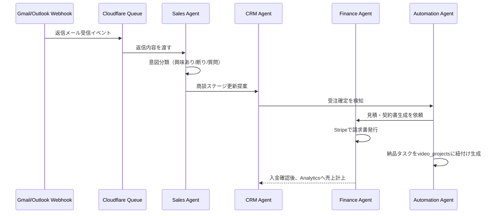

# AI Motion Design Factory — 設計ドキュメント③
## AI Agent設計 / Workflow設計

> **📌 更新あり（Workflow設計は全面置き換え）**：[`06-oss-free-stack.md`](./06-oss-free-stack.md) 参照。§3の「Cloudflare Workflows (`WorkflowEntrypoint`)」によるパイプライン実装は、**Postgresの`pipeline_runs`テーブル + OrchestratorワーカーのCron Trigger（毎分ポーリング）による状態マシン**に置き換えられました（Workflowsの無料枠の扱いが不明瞭だったため）。実装は`workers/orchestrator/src/pipeline.ts`と`src/index.ts`を正としてください。ステップの分解・リトライの考え方・承認ゲートの設計思想（§3.2）はそのまま有効です。13エージェントの設計（§1〜2）も変更ありません（LLM呼び出しは`callClaude`から`callLLM`に変わり、既定プロバイダがWorkers AIになった点のみ差分です）。

---

## 1. エージェント設計の全体方針

- 各エージェント = **1つのDurable Objectクラス**（`agents`パッケージの`Agent`を継承）。テナント×エージェント種別ごとにインスタンスをアドレッシング（`getAgentByName(env.SalesAgent, \`${tenantId}\`)`）
- **並列実行**が必要な組（例：Motion Designer / Copywriter / QA は同じ動画プロジェクトに対し並列で走れる）はOrchestrator Workflowから`Promise.all`相当で同時に`step.do`を発火
- 状態は`this.setState`で同期可能な軽量なものと、`this.sql`（DO組み込みSQLite）で永続化する実行履歴の2種類を使い分け
- 全エージェントの実行は`agent_runs`テーブルに記録（コスト・トークン・所要時間） → Analytics Agentが集計

## 2. 13エージェント仕様

| # | Agent | 役割 | 主な入力 | 主な出力 | 使用MCP |
|---|---|---|---|---|---|
| 1 | **Motion Designer** | 動画全体のビジュアル設計統括 | `promptSpec`, ブランド情報 | 最終`generate_video`呼び出しパラメータ | motion-generator |
| 2 | **Prompt Engineer** | LP/画像/ブランド情報から構成・カメラワーク・カラー・BGM・字幕・CTAを生成 | `products.analyzed_data` | `promptSpec` (JSON) | knowledge |
| 3 | **Storyboard** | シーン単位の絵コンテ・尺配分を設計 | `promptSpec` | シーン配列（尺・カット割り） | knowledge |
| 4 | **Video Director** | 15/30/60秒のバリエーション統括、ポートフォリオサイト生成の指示出し | 複数`video_assets` | `portfolio_sites`レコード | motion-generator |
| 5 | **Copywriter** | 広告コピー・CTA文言・字幕テキスト生成 | 商品分析結果 | コピーバリエーション | knowledge |
| 6 | **Lead Finder** | 企業探索・企業/担当者情報のエンリッチ・スコアリング | 検索条件（業種・地域・広告品質等） | `leads`レコード群 | lead-enrichment（**公式APIのみ**） |
| 7 | **Sales Agent** | パーソナライズ営業文・提案資料・見積の生成、返信の意図分類 | `leads`, 生成済み動画 | `outreach_messages`（**下書きのみ、送信は承認後**） | communication, motion-generator |
| 8 | **CRM** | 商談ステージ更新、活動履歴の要約 | 返信内容・商談イベント | `deals`更新 | crm-finance |
| 9 | **Finance** | 見積・請求書生成、入金確認、アップセル提案 | `deals`, Stripeイベント | `invoices` | crm-finance |
| 10 | **QA** | 生成動画の品質チェック（尺・ブランド整合・不適切コンテンツ検知） | `video_assets` | `qa_status`, 修正指示 | motion-generator, Workers AI(vision) |
| 11 | **Knowledge** | RAGソースの取り込み・インデックス化・検索対応 | Notion/GitHub/GDrive/PDF等 | `knowledge_chunks` | knowledge |
| 12 | **Analytics** | 指標集計・異常検知・改善提案の自然言語生成 | `agent_runs`, 業務テーブル群 | `analytics_daily_rollups`, 提案テキスト | crm-finance |
| 13 | **Automation** | パイプライン全体のオーケストレーション・例外処理・人への承認依頼 | 全エージェントの状態 | Workflow制御 | 全MCP |

### 2.1 実装パターン（例：Sales Agent）

```typescript
import { Agent } from "agents";

interface SalesAgentState {
  pendingApprovals: string[]; // outreach_message id
  sentToday: number;
}

export class SalesAgent extends Agent<Env, SalesAgentState> {
  async draftOutreach(leadId: string) {
    const lead = await this.getLead(leadId);
    const suppressed = await this.callMcpTool("communication", "check_delivery_status", { email: lead.contact_email });
    if (suppressed.isSuppressed) {
      return { skipped: true, reason: "suppression_list" };
    }

    const draft = await this.env.ANTHROPIC.messages.create({
      model: "claude-sonnet-4-6",
      max_tokens: 1200,
      system: SALES_COPYWRITING_SYSTEM_PROMPT,
      messages: [{ role: "user", content: JSON.stringify({ lead, brand: this.state }) }],
    });

    // 必ず pending_approval で保存。自動送信はしない（承認ゲート、詳細は下記3.2）
    const message = await this.saveDraftMessage(leadId, draft, status: "pending_approval");
    this.setState({ ...this.state, pendingApprovals: [...this.state.pendingApprovals, message.id] });
    return message;
  }
}
```

---

## 3. Workflow設計

### 3.1 エンドツーエンド自動化パイプライン

ユーザーが商品URL/画像をアップロードした際の全体フローを、Cloudflare Workflowsの1インスタンスとして定義します。

```typescript
import { WorkflowEntrypoint, WorkflowStep, WorkflowEvent } from "cloudflare:workers";

type Params = { tenantId: string; productId: string };

export class MotionFactoryPipeline extends WorkflowEntrypoint<Env, Params> {
  async run(event: WorkflowEvent<Params>, step: WorkflowStep) {
    const { tenantId, productId } = event.payload;

    // 1. 商品分析
    const analysis = await step.do("analyze-product", async () =>
      callAgent(this.env, "prompt-engineer", { tenantId, productId })
    );

    // 2. 動画生成（Storyboard → Motion Designer → 3尺を並列生成）
    const promptSpec = await step.do("build-storyboard", async () =>
      callAgent(this.env, "storyboard", { tenantId, analysis })
    );

    const variants = await step.do(
      "generate-video-variants",
      { retries: { limit: 3, delay: "30 second", backoff: "exponential" }, timeout: "20 minutes" },
      async () => Promise.all(
        ["15s", "30s", "60s"].map(d => callAgent(this.env, "motion-designer", { tenantId, productId, promptSpec, duration: d }))
      )
    );

    // 3. QAチェック（不合格なら再生成、最大2回）
    const qaResult = await step.do("qa-check", async () => callAgent(this.env, "qa", { tenantId, variants }));
    if (qaResult.status === "flagged") {
      await step.do("regenerate-flagged", async () => callAgent(this.env, "motion-designer", { tenantId, retry: qaResult.flaggedIds }));
    }

    // 4. ポートフォリオ生成・公開
    const portfolio = await step.do("publish-portfolio", async () =>
      callAgent(this.env, "video-director", { tenantId, variants })
    );

    // 5. 見込み客探索（テナントが有効化している場合のみ）
    const leads = await step.do("find-leads", async () => callAgent(this.env, "lead-finder", { tenantId }));

    // 6. 営業文の"下書き"生成（送信はしない）
    const drafts = await step.do("draft-outreach", async () =>
      callAgent(this.env, "sales", { tenantId, leads, portfolioUrl: portfolio.url })
    );

    // 7. 人間の承認待ち（Workflowsのsleepで一時停止、承認はAPIからresumeで再開）
    await step.sleep("await-human-approval", "24 hours");
    // 実際には承認APIが呼ばれるまで待機するイベント駆動型に置き換え可能

    // 8. 承認済みメッセージのみ送信キューへ
    await step.do("enqueue-approved-sends", async () => enqueueApprovedMessages(this.env, tenantId));

    // 9〜: 返信管理・受注管理・納品・請求は別Workflow（イベント駆動）に分離
    //     （返信/入金/納品完了はいずれも「いつ起きるか分からない」ため、
    //      同一Workflow内でstep.sleepし続けるのではなく、Queues + 個別Workflowで処理する設計とします）
  }
}
```

### 3.2 なぜ「全自動」ではなく承認ゲートを挟むのか

ご依頼原文の末尾で明示された「利用者の明示的な確認や承認フローを組み込む」を、パイプラインの構造そのものに反映しています。技術的な理由も3点あります。

1. **配信品質**：ウォームアップされていない送信ドメインから無承認で大量送信すると、スパム判定・到達率低下を招き、結果的に営業効果が下がります
2. **法令遵守**：CAN-SPAM法・GDPR・日本の特定電子メール法など、地域により同意要件が異なります（詳細はドキュメント⑤）。自動判定だけに頼らず、境界事例は人が最終判断する設計が安全です
3. **ブランドリスク**：AIが生成した営業文をレビューなしで数千社に送るのは、たとえ内容が正確でも事業者としてのリスクが大きいため、少なくとも初期は「AIが下書き、人がワンクリック承認」を既定にすることを推奨します（プランが上がるにつれ自動化度を上げる設計は可能です）

### 3.3 返信管理〜請求までのイベント駆動フロー



### 3.4 並列実行の設計ポイント

- 同一動画プロジェクト内の**15秒/30秒/60秒バリエーション生成**は独立ジョブとして並列発火（`Promise.all`）
- **Lead Finder**は情報ソースごと（Google Maps検索・Product Hunt検索…）に並列ワーカーを立て、結果をマージしてから重複排除・スコアリング
- **QA**と**Copywriter**は同じ動画に対して並列に走らせ、両方の結果が揃ってからVideo Directorが最終判断

続けて `04-uiux-roadmap-mvp.md` でUI/UX設計・実装ロードマップ・MVP設計をご覧ください。
