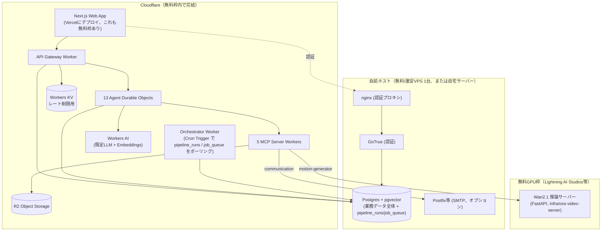

# AI Motion Design Factory — 設計ドキュメント⑥
## OSS・無料構成ガイド（Cloudflare有料機能・商用SaaSの置き換え）

このドキュメントは、当初の設計（ドキュメント①〜⑤）にあった有料/プロプライエタリな依存を、オープンソース・無料枠のみで動く構成に置き換えた際の変更点をまとめたものです。**「ソフトウェアのライセンス費用が$0」という意味であり、「実運用のインフラが完全に$0」という意味ではありません** — この違いは §4 で正直にお伝えします。

---

## 1. 何を、何に置き換えたか

| 領域 | 当初案（ドキュメント①〜⑤） | 置き換え後 | 理由 |
|---|---|---|---|
| DBアクセス | Cloudflare Hyperdrive + Supabase (マネージド) | 自前ホストのPostgres（`pgvector/pgvector`イメージ）に`DATABASE_URL`で直接接続 | Hyperdriveは **Workers Paidプラン専用**（$5/月〜）と確認済み。Supabaseクラウドも無料枠はあるが上限あり、かつ本質的にはマネージドSaaS |
| ベクトル検索 | Cloudflare Vectorize | 自前Postgresの`pgvector`拡張 | Vectorizeは**Workers Paidプラン専用**と確認済み |
| オーケストレーション | Cloudflare Workflows | Postgres上の`pipeline_runs`テーブル + Orchestrator WorkerのCron Trigger（毎分ポーリング） | Workflowsの無料枠の扱いが不明瞭だったため、確実に無料枠のあるCron Trigger + 通常のWorkers実行に寄せた |
| 非同期ジョブキュー | Cloudflare Queues | Postgres上の`job_queue`テーブル + 同じCron Triggerでドレイン | Queuesも無料枠が限定的。DBが既にあるため追加の課金対象を増やさない設計に |
| 認証 | Clerk（商用SaaS、無料枠あり） | 自前ホストのSupabase Auth (GoTrue) + 最小限のnginxリバースプロキシ | Clerkはオープンソースではない。GoTrueはOSS（MIT）で、Postgresさえあれば自前運用可能 |
| LLM（Agent推論） | Anthropic Claude固定 | **既定はCloudflare Workers AI**（オープンウェイトモデル、無料枠あり）、Ollama（完全セルフホスト）/Anthropic/OpenAIをオプトインで選択可能 | Workers AIは無料枠内で完結し、モデル自体もオープンウェイト。Ollamaを選べば外部API依存すらゼロにできる |
| Embeddings（RAG用） | OpenAI `text-embedding-3-small` | **既定はWorkers AIの`bge-base-en-v1.5`**（オープンウェイト、768次元） | 同上の理由。OpenAIは引き続きオプトイン可能（`knowledge_chunks.embedding`の次元を1536に変更すれば） |
| メール送信 | Resend（商用SaaS） | Workers Sockets APIで実装した最小SMTPクライアント（`workers/mcp-servers/communication/src/smtp.ts`） | 自前Postfixや、無料枠のあるSMTPリレーなど、どんなSMTPサーバーとも通信できる汎用実装に |
| 動画生成AI | Runway/Kling/Luma等の商用API | **オープンウェイト動画モデル（Wan2.1）を無料GPU枠（Lightning AI Studios等）でセルフホスト**（`oss-selfhosted`プロバイダ） | §3で詳述。商用APIプロバイダのアダプタ（Runway/Kling）自体はコードとして残してあり、必要に応じて併用可能 |

## 2. 全体アーキテクチャ（更新版）



## 3. 動画生成モデルについて（Wan2.1 / HunyuanVideo を無料GPU枠で）

**結論：feasibleです。ただし「開発・デモ・小規模な実運用」向けであり、「商用SaaSとして数百本/月を生成し続ける」には力不足です。**

| モデル | 必要VRAM目安 | 無料GPU枠での可否 |
|---|---|---|
| Wan2.1 T2V-1.3B（既定） | fp16で約8GB、GGUF量子化で4〜6GB | T4(16GB)/L4(24GB)/A10G(24GB)で余裕あり |
| Wan2.1/2.2 14B（fp8） | 約24GB | L4/A10Gでギリギリ、T4では不可 |
| Wan2.1/2.2 14B（GGUF+CPUオフロード） | 約6〜12GB | T4/L4/A10Gで可、速度は遅い |
| HunyuanVideo（オリジナル13B） | 量子化次第で24〜60GB | 積極的な量子化前提でL4/A10Gが限界 |
| HunyuanVideo 1.5（8.3B） | 推奨16GB、オフロードで12GB | T4はギリギリ、L4/A10Gで余裕あり |

Lightning AIの無料枠は、確認時点で**月あたり約80 GPU時間**（T4/L4/A10G/L40S）を提供しています。これは開発・デモ・低頻度な実運用には十分ですが、**商用SaaSとして安定運用するには全く足りません**。無料枠内に収める（開発/ステージング用途）か、実際の課金GPU（Lightning AIの有料枠、RunPod、Modal、自前GPU等）に移行するかを、テナントが増えた時点で判断してください。Lightning AIの無料枠の条件・GPU種類・そもそもの提供元は将来変わる可能性があるため、実装前に必ずlightning.aiで最新情報をご確認ください。

実装は`infra/oss-video-server/`に置いてあります（FastAPI + diffusers + Wan2.1、`motion-generator-mcp`の`oss-selfhosted`プロバイダから呼び出し）。セットアップ手順は同ディレクトリの`README.md`を参照してください。

## 4. 正直な話：「無料」の範囲

以下は依然として**外部の何か**が必要です。ソフトウェア自体はすべてOSSですが、動かす場所はゼロにはなりません。

| 必要なもの | ゼロコストで賄う方法の例 | 注意点 |
|---|---|---|
| Postgres + GoTrue + nginxを動かすサーバー1台 | Oracle Cloud Free Tier（Always Free枠、ARM 4コア/24GB RAM程度が歴史的に無期限無料）、Fly.ioの無料枠、自宅サーバー/Raspberry Pi | 無料クラウド枠の内容は各社の判断で変わり得ます。契約内容を定期的に確認してください |
| 動画生成用GPU | Lightning AI Studiosの無料GPU時間（§3） | 商用運用には不十分。スケール時は有料GPU必須 |
| ドメイン名 | 完全無料は難しいが、年間$10前後が最安級 | `.dev`等の一部TLDが安価。既存ドメインの利用も可 |
| TLS証明書 | Let's Encrypt（完全無料） | nginx/Caddyでの自動更新設定が必要 |
| Cloudflare Workers/DO/KV/R2/Workers AI | 無料枠内で完結（§5の表参照） | 無料枠を超えると従量課金（Workers Paidは$5/月〜） |
| メール送信の到達率 | 自前Postfixは可能だが、SPF/DKIM/DMARC設定とIPウォームアップなしでは高確率で迷惑メール判定される | ドキュメント⑤ §3.4の通り、コールドアウトリーチは特に注意が必要。無料枠のあるSMTPリレー（一部プロバイダの少量無料枠）を初期は使う方が現実的な場合も |

## 5. Cloudflare無料枠リファレンス（2026年7月時点で確認）

| サービス | 無料枠 |
|---|---|
| Workers | 100,000リクエスト/日、CPU時間10ms/リクエスト |
| Durable Objects | Freeプランで利用可（SQLiteバックエンドのみ）。日次無料枠あり |
| Workers KV | 1GBストレージ、読み取り100,000/日、書き込み1,000/日 |
| R2 | 10GBストレージ、Class A操作100万/月、Class B操作1,000万/月、**egress（転送)は常に無料** |
| Workers AI | 10,000推論/日（対象モデル） |
| Hyperdrive | **Workers Paidプラン専用**（無料枠なし） |
| Vectorize | **Workers Paidプラン専用**（無料枠なし） |

無料枠の数字はCloudflareの判断で変わることがあります。本番投入前に [developers.cloudflare.com](https://developers.cloudflare.com/workers/platform/pricing/) で最新の数字を確認してください。

## 6. セットアップ手順（要約）

```bash
# 1. 自前インフラを起動
cp .env.example .env
# .env を編集: POSTGRES_PASSWORD, GOTRUE_AUTH_ADMIN_PASSWORD を設定
node scripts/generate-supabase-keys.mjs "$(openssl rand -base64 48)"
# 出力された SUPABASE_JWT_SECRET / NEXT_PUBLIC_SUPABASE_ANON_KEY を .env に反映
docker compose -f infra/docker-compose.yml up -d

# 2. スキーマ確認（初回はdocker-entrypoint-initdb.dで自動実行済みのはず）
psql "$DATABASE_URL" -c "\dt"

# 3. Cloudflareリソースのプロビジョニング
wrangler kv namespace create RATE_LIMIT_KV
wrangler r2 bucket create motion-factory-assets
# wrangler.jsonc各ファイルのプレースホルダIDを実IDに置き換え

# 4. 各Workerをローカル起動（別ターミナルで並行）
pnpm dev:gateway
pnpm dev:agents
pnpm dev:orchestrator
# 5つのMCPサーバーも同様に `wrangler dev` で起動

# 5. （オプション）ローカルLLMを使う場合
docker compose -f infra/docker-compose.yml --profile local-llm up -d
docker compose -f infra/docker-compose.yml exec ollama ollama pull llama3.1
# workers/agents/wrangler.jsonc の LLM_PROVIDER を "ollama" に変更

# 6. （オプション）動画生成を実物にする場合
# infra/oss-video-server/README.md の手順でLightning AI等にデプロイし、
# OSS_VIDEO_ENDPOINT_URL を設定、MOTION_GENERATOR_DEFAULT_PROVIDER を
# "oss-selfhosted" に変更
```

## 7. この構成のまま商用化する場合の現実的な移行ライン

無料構成のまま素早く検証・立ち上げるのは合理的ですが、以下のタイミングでは有料オプションへの切り替えを検討してください。

- **テナントが増え、Postgres接続数がボトルネックになったら** → Hyperdrive（Workers Paid）またはPgBouncerの追加
- **動画生成の量が無料GPU時間を超えたら** → Lightning AI有料枠、RunPod、または商用API（Runway/Kling、アダプタは実装済み）
- **送信ドメインの評判・到達率が課題になったら** → 実績あるトランザクショナルメール事業者への切り替え
- **Workers AIの無料枠（推論数）を超えたら** → Workers Paid、またはAnthropic/OpenAIへの切り替え（`LLM_PROVIDER`を変更するだけ）

いずれも設計上「envの値を変えるだけ」で切り替えられるよう抽象化してあるため、無料構成からの移行コストは低く抑えてあります。
